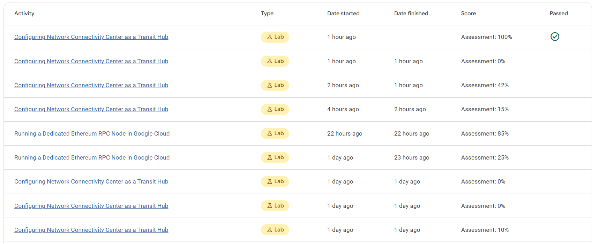

This lab was so long to finish 😭 It wasn't hard but there were a lot of steps to follow and I realized how using CLI to configure network connectivity (the VPC transit, firewall rule, all that shebang) is way better than using the GUI. The GUI is just too slow and cumbersome for this kind of work.

