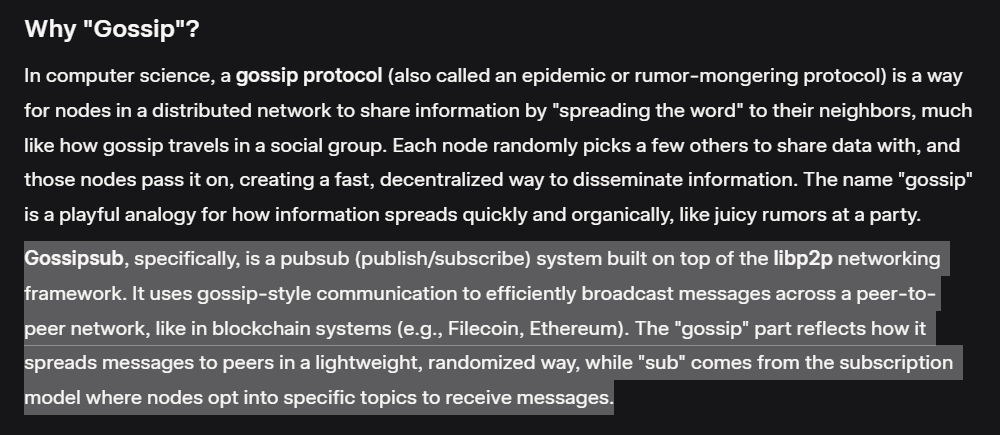

This lab was so interesting. I've heard a lot about Ethereum but I don't really know how it works so I learned bits and pieces about Geth (execution layer) and Lighthouse (consensus layer). Two things I remember the most:

- I did a silly mistake yesterday where I ended up the lab immediately when I saw all these reds. I thought it was an error and it was almost midnight, but after redoing it today turned out it was just config stuff daym 😂 Lesson learned: read carefully

- I had no idea that tech would use terms like 'gossip' for something technical like this. When I saw it I was like >> what o_O? But it does make sense after knowing the reason behind it XD

