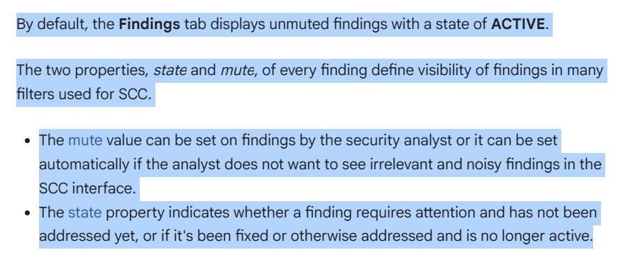
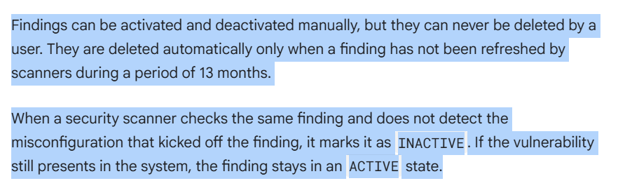

# Lab 26: Get Started with Security Command Center

Security Command Center (SCC) is a security monitoring platform that helps users accomplish the following:

- Discover security-related misconfigurations of Google Cloud resources.
- Report on active threats in Google Cloud environments.
- Fix vulnerabilities across Google Cloud assets.

## Vulnerabilities and Threats

On the Risk Overview page, we can investigate information panels that refer to **New threats over time** and **Vulnerabilities per resource type**. What's the difference?

- Threats are active, real-time indicators of suspicious or malicious activities in your Google Cloud environment. Example: a service account investigating its own permissions might suggest unauthorized access or reconnaissance, prompting immediate attention to stop or investigate the activity. We only learned how to deal with vulnerabilities in this lab.

- Vulnerabilities are potential weaknesses or misconfigurations that could be exploited, but aren't necessarily active. Examples include an open TCP port (a security gap) or an outdated library (a software flaw), which highlight risks that need fixing to prevent future threats.
  

The severity is a property of the finding that helps to estimate the potential risk that an issue poses to the Google Cloud environment. The level of severity cannot be changed, each type of finding has a severity level that is predetermined by SCC.

- **Critical** - For example, a Reverse Shell session launched from inside of a GKE Pod.
- **High** - For example, an SSH port opened to the entire Internet (0.0.0.0/0);
- **Medium** - For example, one of primitive IAM roles (Owner/Editor/Viewer) has been granted to a user or a service account.
- **Low** - For example, no VPC Flow logs are collected.
- **Unspecified** - Can appear in SCC, but is not common.
  
  

## Finding Tab

By default, the Findings tab shows only "unmuted" findings that are in "ACTIVE" state. This means it highlights issues that need your attention and haven’t been silenced. What's mute and state?

- State: This tells you if a finding still needs action. "ACTIVE" means the problem (like a misconfiguration) is still there and needs fixing. "INACTIVE" means it’s been resolved or no longer detected.
- Mute: This is like a mute button. A security analyst (or the system) can mute findings to hide ones that are noisy or irrelevant, so they don’t clutter your view.

How mute and state work?

- You can mute findings manually if you don’t want to see them (e.g., false alarms).
- The state changes based on whether the issue is fixed. You can manually set a finding to inactive if you’ve addressed it, but you can’t delete findings yourself. They auto-delete after 13 months if scanners don’t refresh them.

How scanners update findings?

- If a scanner checks and no longer sees the problem (like a fixed misconfiguration), it marks the finding "INACTIVE".
  If the problem still exists, the finding stays "ACTIVE" to remind you to fix it.

  Original explanation:
  
  

A majority of these findings (80-ish) were generated because I was using a default VPC network, which is insecure by design, for the purposes of this lab. For example, it contains firewall rules that allow SSH and RDP access from any IP address.

How to address a finding? There are many ways, in this lab the firewall rule was updated by changing the source IP range from 0.0.0.0/0 (default VPC) to 35.235.240.0/20 (https://cloud.google.com/iap/docs/using-tcp-forwarding)

