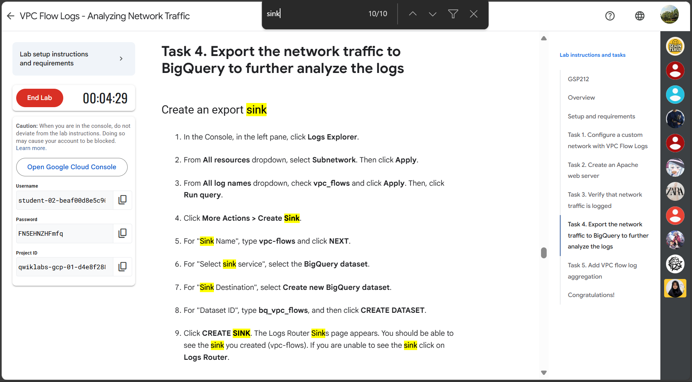

When I read this the instruction I was confused with this "Sink" term o_o

- The term "sink" comes from the concept of a data pipeline where logs flow from a source (Google Cloud's logging system) to a destination (like BigQuery). The sink is the endpoint where the data "lands" or is "collected" for further processing.
- In lab: the sink I created (`vpc-flows`) is a configuration that routes VPC Flow Logs to a BigQuery dataset (`bq_vpc_flows`) for analysis.

Lab notes:

- **Aggregation time interval**: Sampled packets for a time interval are aggregated into a single log entry. This time interval can be 5 sec (default), 30 sec, 1 min, 5 min, 10 min, or 15 min.
- **Log entry sampling**: Before being written to the database, the number of logs can be sampled to reduce their number. By default, the log entry volume is scaled by 0.50 (50%), which means that half of entries are kept. You can set this from 1.0 (100%, all log entries are kept) to 0.0 (0%, no logs are kept).
