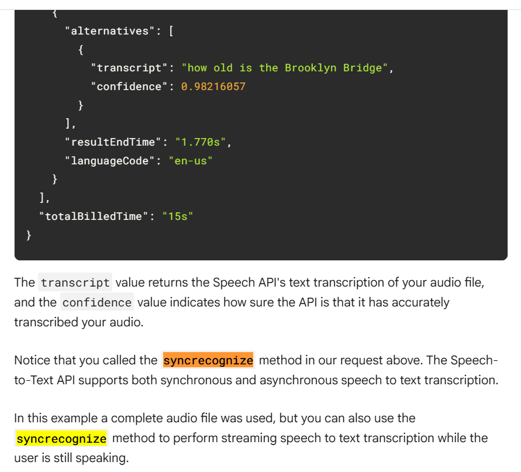

# Lab 1 - Speech to Text Transcription with the Cloud Speech API

This lab focuses on using the Google Cloud Speech-to-Text API to transcribe audio files into text.

Lab links:

- Arcade: https://www.cloudskillsboost.google/games/6394/labs/40265
- General: https://www.cloudskillsboost.google/focuses/2187?parent=catalog

Personal insights:

- I learned how to transcribe audio files using the Cloud Speech-to-Text API, which supports over 80 languages and their variants.

- It's really cool to see how it works. As someone who uses speech-to-text a lot, I usually just speak and the AI transcribes my words into text almost instantly. So learning the process manually (from generating the API key first to retrieving the transcription result) is so interesting :D

- I relearned how to use vim after ditching it years ago (had to for a mandatory uni course). It's cool to use and seems I'll have to stick with it for all these labs. But tbh nothing's changed, I still don’t feel it helps my workflow much beyond boosting my programmer ego 🤓

- For the 3rd task, the lab asked us to call the speech-to-text API using a sample audio file

  ```bash
  curl -s -X POST -H "Content-Type: application/json" --data-binary @request.json \
  "https://speech.googleapis.com/v1/speech:recognize?key=${API_KEY}" > result.json
  ```

  This `curl` command works fine as expected, hitting the `speech:recognize` endpoint for synchronous transcription and saving the output to `result.json`. But the lab instructions mention a non existent `syncrecognize` method 2x. That’s just a typo, if you tried using `speech:syncrecognize`, you’d get an error since the API only supports `speech:recognize` for sync jobs or `speech:longRunningRecognize` for async ones (documentation: https://cloud.google.com/speech-to-text/docs/reference/rest/v1/speech). The command itself is solid tho, the mistake’s just in the lab’s explanation text, not the actual code.

  
