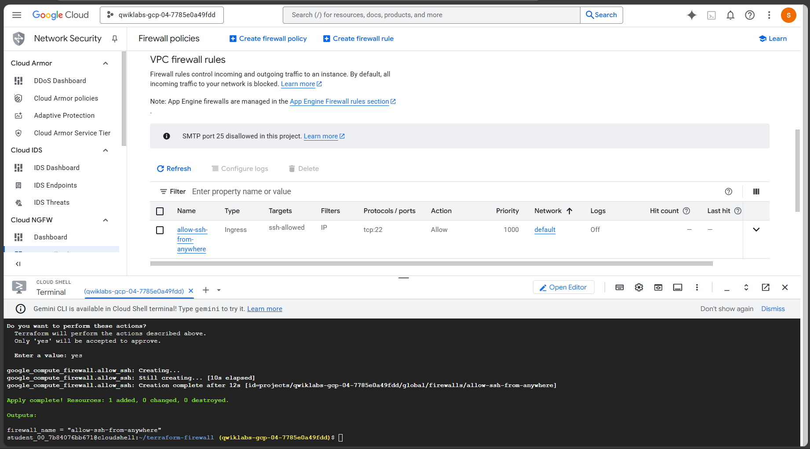

SOOO in [lab 24](https://github.com/laiflonglearner/google-cloud-arcade-2025/tree/main/Basecamp%20August/lab-24_configurin-network-connectivity-center-as-a-transit-hub) I learned how to configure NCC and I was complaining that the lab was too long and I wish there were easier ways to set things up using CLI and this is the answer! This lab guided us how to create firewall rule, but yeah this is using terraform so the commands needed for other cases might be different ^-^

